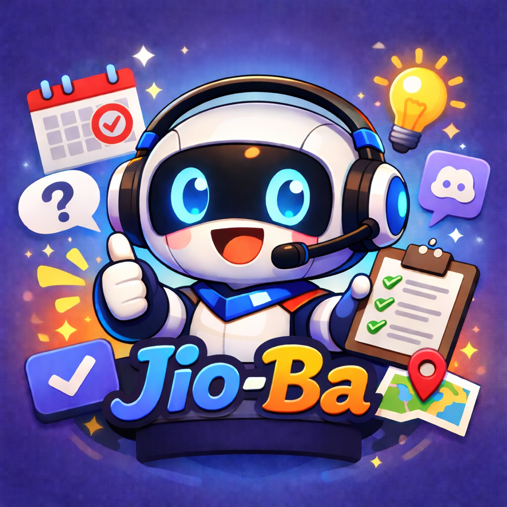

<!-- PROJECT LOGO -->
<br />
<div align="center">
  <a href="https://github.com/YHC2538/Jio-Ba">
    
  </a>

  <h3 align="center">Jio-Ba</h3>

  <p align="center">
    Turn "group planning is painful" into "one sentence and the event is live".
    <br />
    <a href="https://github.com/YHC2538/Jio-Ba"><strong>View the project »</strong></a>
    <br />
    <br />
    <a href="https://github.com/YHC2538/Jio-Ba/issues">Report a bug</a>
    &middot;
    <a href="https://github.com/YHC2538/Jio-Ba/issues">Request a feature</a>
  </p>
</div>

[Traditional Chinese README](./README.zh-TW.md)

## 🤖 Why Jio-Ba?

You’ve probably run into this situation before:

- Everyone says "anything works", and the group still never converges.
- Messages get buried, and the host has to manually summarize everyone’s needs.
- Conflicting preferences around time and location leave someone stuck compromising.

Jio-Ba is not just a bot that helps you ask questions. It is a **Discord activity coordination console**:

1. Turn natural-language requests into structured 4W1H.
2. Use a DM interview flow to narrow down each participant’s real preferences.
3. Temporarily suspend malicious or uncooperative replies into ON_HOLD and let the host decide.
4. Use Nash Social Welfare (NSW) at the end to generate candidate plans and let the host finalize one quickly.

## 📢 Core Capabilities

- Activity creation and management (title, description, deadlines, minimum participant count, custom questions).
- Automatic extraction and display of 4W1H seeds (What/Where/When/How, and Why when needed).
- AI-generated interview questions that fill in missing information instead of using a fixed questionnaire.
- DM interview flow (question-by-question, follow-up, and confirmation before submission).
- Handling malicious participants with warnings, ON_HOLD, and host verdicts CONTINUE/KICK.
- Real-time channel dashboard updates (Joined/Interviewing/ON_HOLD/Ready/Kicked).
- Final-plan announcement and Discord Scheduled Event integration.

## 🔑 Host Flow

1. Enter `/jio` in a server.
2. Fill in the activity information, then the bot posts the activity card and Join button.
3. After participants join, signup closes or the host ends it early, and the DM interview starts.
4. Once interviews finish, the system generates a staff report and candidate plans for the host.
5. The host chooses the final plan, and the bot announces the result and closes the flow.

## 📜 Available Commands

- `/jio`
  Start an activity (supports parameters such as title and time limits).
- `/verdict`
  Open the ON_HOLD member adjudication UI.

## ⚓ Architecture and Modules

Built with LangChain and LangGraph to structure the AI agent workflow.

- `main.py`
  Bot entry point, environment checks, and cog loading.
- `cogs/jio.py`
  Slash commands, Discord UI, activity orchestration, and dashboard updates.
- `cogs/ai_brain.py`
  Participant message queue, debounce, LangGraph calls, and state write-back.
- `cogs/graph_agent.py`
  Interview graph nodes (analyze / reprompt / next_question / malicious / hold / finalize).
- `cogs/db.py`
  MongoDB access, and activity and participant state transitions.
- `cogs/matching/nsw_calculator.py`
  NSW candidate plan scoring and ranking.

## 📌 Requirements

- Python `>=3.10,<3.11`
- MongoDB
- Discord Bot Token
- Google API Key (Gemini)

## 📁 Environment Variables

Set these in `.env`:

```env
DISCORD_TOKEN=your_discord_token
MONGO_URI=your_mongodb_uri
GOOGLE_API_KEY=your_google_api_key
GOOGLE_API_ENDPOINT=https://generativelanguage.googleapis.com
```

## ✈️ Local Installation

### Using pip

```bash
pip install .
python main.py
```

### Using uv

```bash
# 1) Install dependencies according to pyproject.toml (uv.lock will also be used if present)
uv sync

# 2) Start the bot
uv run python main.py
```

## ⛰️ PM2 Deployment

The repository includes `ecosystem.config.js`, which can be enabled after adjusting the Python interpreter path for your environment:

```bash
pm2 start ecosystem.config.js
pm2 logs
pm2 save
```

## 💡 Ops Notes

- Enable Message Content Intent in the Discord Developer Portal, otherwise DM interview behavior will be limited.
- If permissions are insufficient, the system may enter limited mode.
- `/jio` must be run in a server channel, not in DM.

## 💰 Credits

Original project design by rlongdragon
