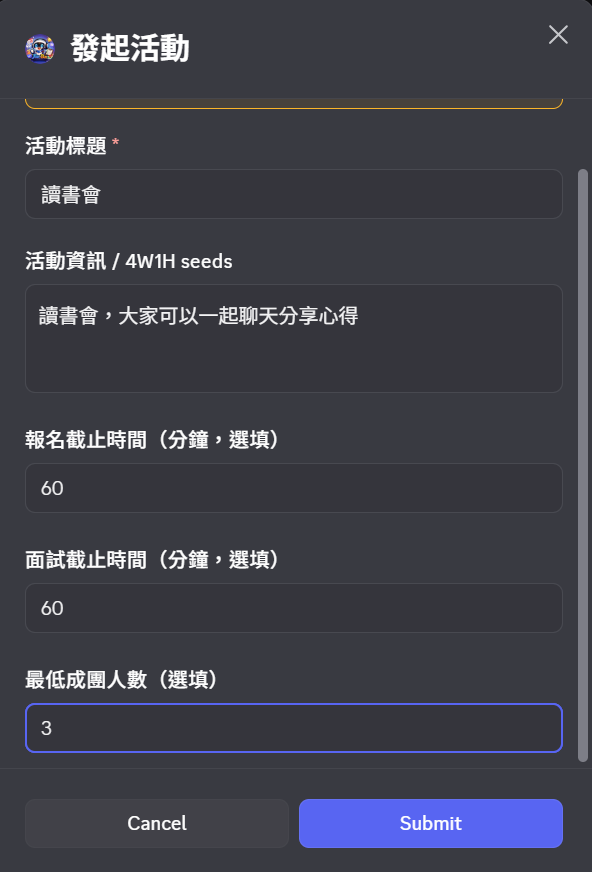
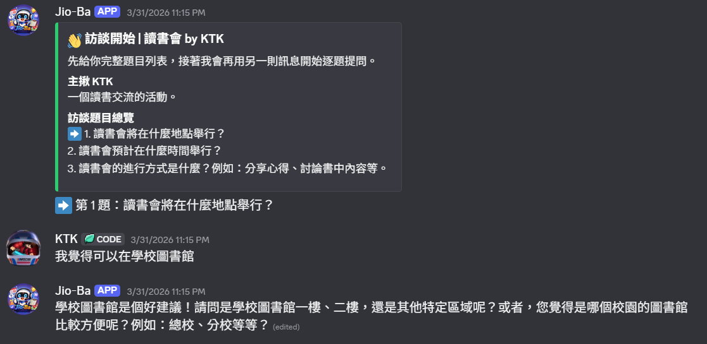
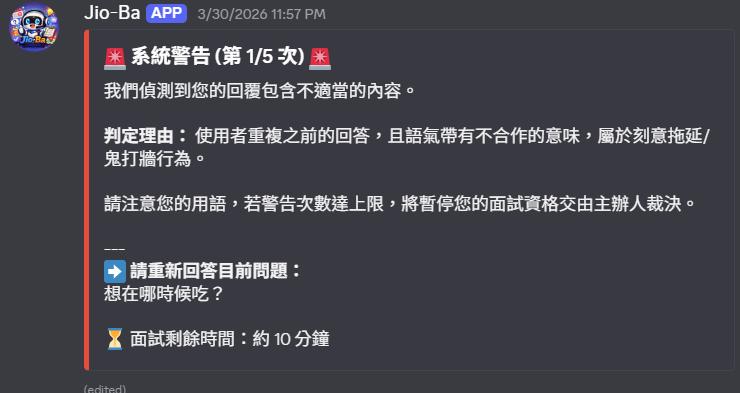
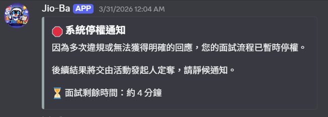
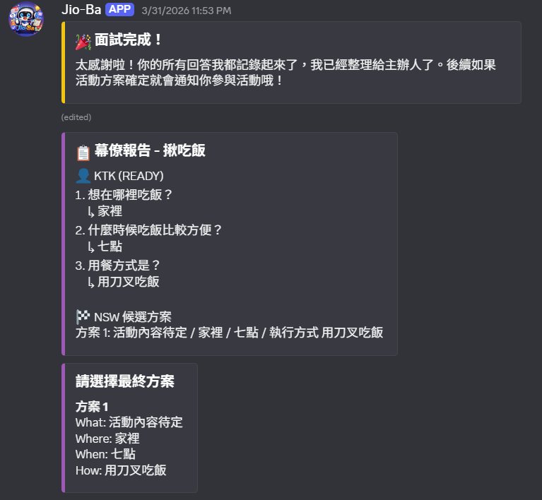

<!-- PROJECT LOGO -->
<br />
<div align="center">
  <a href="https://github.com/YHC2538/Jio-Ba">
    
  </a>

  <h3 align="center">Jio-Ba</h3>

  <p align="center">
    Turn "group planning is painful" into a Discord AI assistant that can launch the event in one sentence.
    <br />
    <a href="https://github.com/YHC2538/Jio-Ba"><strong>View the project »</strong></a>
    <br />
    <br />
    <!-- INSERT SHEILDS IO -->
    
    
    
    
    
    
    <br />
    <br />
    <a href="https://github.com/YHC2538/Jio-Ba/issues">Report an issue</a>
    &middot;
    <a href="https://github.com/YHC2538/Jio-Ba/issues">Request a feature</a>
  </p>
</div>

[Traditional Chinese README](./README.zh-TW.md)

## 🤖 Why Jio-Ba?

You have probably been in this situation before:

- A group of people keeps saying "anything works", but nothing ever gets decided.
- Messages get buried, and the host has to manually sort out everyone’s needs.
- Time and location preferences conflict, so someone always ends up compromising.

Jio-Ba is not just a bot that asks questions. It is a **Discord-based activity coordination console**:

1. Convert natural language into structured 4W1H.
2. Narrow each participant’s real preferences through a DM interview flow.
3. Temporarily suspend malicious or uncooperative replies into ON_HOLD and let the host make the call.
4. Use Nash Social Welfare (NSW) to generate candidate plans and let the host finalize quickly.

## 💎 Core Capabilities

- Activity creation and management (title, description, deadline, minimum participant count, custom questions).
- Automatic extraction and display of 4W1H seeds (What/Where/When/How, and Why when needed).
- AI-generated interview questions that fill in missing information instead of using a fixed questionnaire.
- DM interview flow (one question at a time, follow-up questions, and confirmation before submission).
- Protection against malicious participants with warnings, ON_HOLD, and host verdicts CONTINUE/KICK.
- Real-time channel dashboard updates (Joined/Interviewing/ON_HOLD/Ready/Kicked).
- Final-plan announcement and Discord Scheduled Event integration.

## 🔑 Host Flow

1. Enter `/jio` in a server.
2. Fill in the activity information, then the bot posts the activity card and Join button.
3. After participants join, signup closes or the host ends it early, and the DM interview begins.
4. After the interview finishes, the system generates a staff report and candidate plans for the host.
5. The host chooses the final plan, and the bot announces the result and closes the flow.

## Snaphots

#### Start an activity

<div align="center">
  
</div>

#### Interview in progress

<div align="center">
  
</div>

#### Warnings and suspension for malicious participants

<div align="center">
  
</div>

<div align="center">
  
</div>

#### Final plan announcement

<div align="center">
  
</div>

## 📜 Available Commands

- `/jio`
  Start an activity (supports parameters such as title and time limits).
- `/verdict`
  Open the ON_HOLD adjudication interface.

## ⚓ Architecture and Modules

<div align="center">
  <a href="https://docs.langchain.com/oss/python/langchain/overview">
    <picture>
      <source media="(prefers-color-scheme: dark)" srcset="./images/langchain-dark.svg">
      <source media="(prefers-color-scheme: light)" srcset="./images/langchain-light.svg">
      
    </picture>
  </a>
  <a href="https://www.langchain.com/langgraph">
    <picture>
      <source media="(prefers-color-scheme: dark)" srcset="./images/langgraph-dark.svg">
      <source media="(prefers-color-scheme: light)" srcset="./images/langgraph-light.svg">
      
    </picture>
  </a>

  Built with LangChain and LangGraph to structure the AI agent workflow
</div>


- `main.py`
  Bot entry point, environment checks, and cog loading.
- `cogs/jio.py`
  Slash commands, Discord UI, activity orchestration, and dashboard updates.
- `cogs/ai_brain.py`
  Participant message queue, debounce, LangGraph calls, and state write-back.
- `cogs/graph_agent.py`
  Interview graph nodes (analyze / reprompt / next_question / malicious / hold / finalize).
- `cogs/db.py`
  MongoDB access, and activity and participant state transitions.
- `cogs/matching/nsw_calculator.py`
  NSW candidate plan scoring and ranking.

## 📌 Requirements

- Python `>=3.10,<3.11`
- MongoDB
- Discord Bot Token
- Google API Key (Gemini)

## 📁 Environment Variables

Set these in `.env`:

```env
DISCORD_TOKEN=your_discord_token
MONGO_URI=your_mongodb_uri
GOOGLE_API_KEY=your_google_api_key
GOOGLE_API_ENDPOINT=https://generativelanguage.googleapis.com
```

## ✈️ Local Installation

### Using pip

```bash
pip install .
python main.py
```

### Using uv

```bash
# 1) Install dependencies according to pyproject.toml (uv.lock will also be used if present)
uv sync

# 2) Start the bot
uv run python main.py
```

## ⛰️ PM2 Deployment

The repository includes `ecosystem.config.js`, which can be enabled after adjusting the Python interpreter path for your environment:

```bash
pm2 start ecosystem.config.js
pm2 logs
pm2 save
```

## 💡 Ops Notes

- Enable Message Content Intent in the Discord Developer Portal, otherwise DM interview behavior will be limited.
- If permissions are insufficient, the system may enter limited mode.
- `/jio` must be run in a server channel, not in DM.

## 💰 Credits

Original project design by rlongdragon
